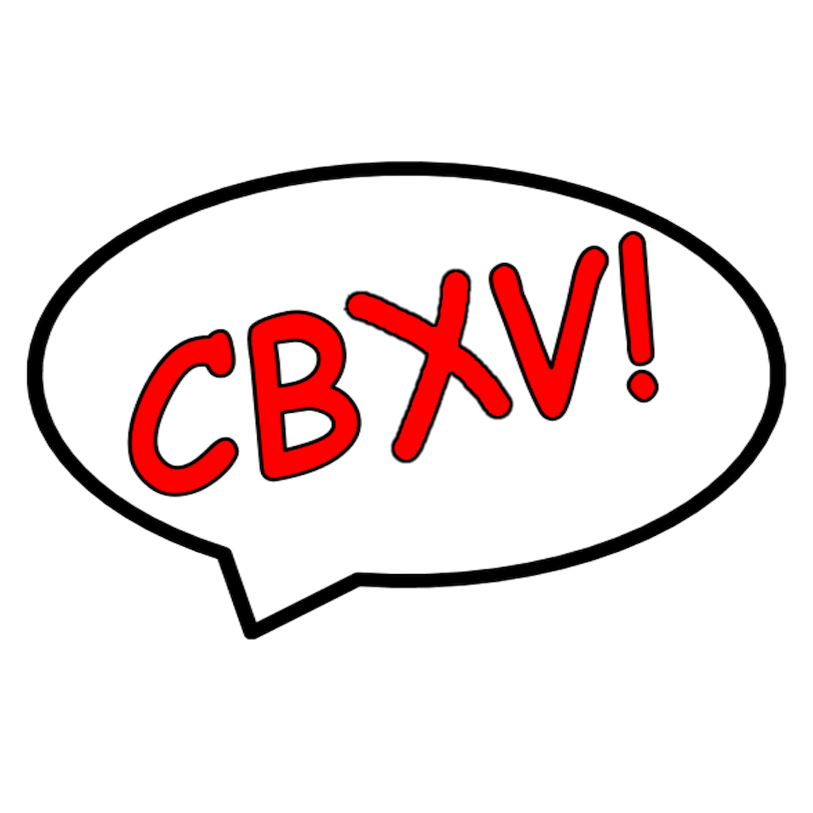

# cbxv - The high fidelity comic book viewer

 

cbxv is a native, desktop, application for viewing comic book (.cbz and .cbr) 
files. It's focus is manipulating the layout so that the art and story can be
appreciated closer to the original intent.

 
 

## Features
- Auto-joining and manual joining of pages
- Auto-layout "reflow"
- Page hiding
- Bi-directional layout
- Layout Persistence
- 2-Page, 1-Page and Strip Layouts
- Bookmarks
- Page Export
- Fullscreen View
- Never alters original files
- Unique HUD Interface
- Native performance

## Dependencies
- Linux
    Gtk3 - You must have Gtk3 installed. This is very common on Linux. If you 
    don't have it already installed you must install the appropriate package 
    for your distro.

    Arch    - gtk3
    Fedora  - gtk3
    Debian  - libgtk-3-0
    Ubuntu  - libgtk-3-0

- Windows and Mac
    Everything that you need is in the archive available under the releases 
    section.

## Installation
