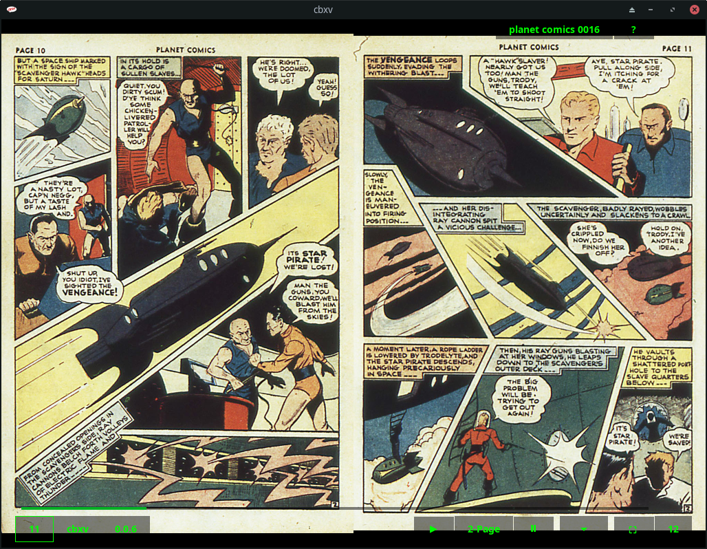

## cbxv - The high fidelity comic book viewer

 

cbxv is a native, desktop application for viewing comic book/manga (.cbz and
.cbr) files. It's focus is manipulating the layout so that the art and story
can be appreciated closer to the original intent.

 

Take for example the beautiful two page spread shown in cbxv below. It's a 
complete scene with two spaceships converging for an epic battle on the left 
and our hero, victorious, exiting the scene in the lower right. In a basic
viewer, even with a cover-to-cover scan, the first two page spread would show 
the cover and inside cover, so that by the time you got to these pages they 
would be misaligned and not shown at the same time, ruining the scene.

Note: All comic images shown on these pages are believed to be in the public domain.
If you feel that's in error, please notify me and I will replace them with ones that
are.

## Features
- Auto-joining and manual joining of pages
- Auto-layout "reflow"
- Bi-directional layout (Left-To-Right and Right-To-Left reading)
- Layout Persistence
- 2-Page, 1-Page and Strip Layouts
- Page hiding
- Bookmarks
- Page Export
- Fullscreen View
- Unique HUD Interface
- Never alters original files
- Supports most common formats; .cbz, .cbr, .cb7, .cbt, .pdf
- Native performance

<a href="https://mftb0.github.io/cbxv">Program Manual</a>

## Dependencies
- Linux - You must have Gtk3 installed. This is very common on Linux. If you 
    don't have it already you must install the appropriate package for your 
    distro.

    - Arch and Fedora   - gtk3
    - Debian and Ubuntu - libgtk-3-0

- Mac - Like Linux you must have Gtk3 installed. This is less common than Linux
    but faily straightforward. Install <a href="https://brew.sh">Homebrew</a> and run:

    brew install pkg-config gtk+3 adwaita-icon-theme

- Windows - Everything that you need is in the archive available under the 
    releases section.

## Installation
-   Linux - Download the Linux build from the release area and unarchive it. 
    On Linux cbxv is a single executable, put it wherever you like and run it. 
    For your convenience a simple script is provided to put a desktop file and 
    icon in the appropriate places for your user.

-   Windows - Download the Windows build from the release area and unarchive it. 
    Copy the resulting directory to program files or wherever you like and run it.

-   Mac - Download the Mac build from the release area and unarchive it. Copy the 
    cbxv.app directory to Applications and double-click on it.

## Usage
    cbxv has an unusual interface, like a game or media player. It is 
    largely keyboard driven, but many functions are also available 
    with the mouse:

    |Command            |Key            |Mouse               |
    |-------------------|---------------|--------------------|
    |quit               |q              |Window Close Button | 
    |openFile           |o              |Title Button        |
    |closeFile          |c              |NA                  |
    |rightPage          |d|l|RightArrow |Right Side          |
    |leftPage           |a|h|LeftArrow  |Left Side           |
    |firstPage          |w|k|UpArrow    |NA                  |
    |lastPage           |s|j|DownArrow  |NA                  |
    |nextFile           |n              |NA                  |
    |previousFile       |p              |NA                  |
    |toggleBookmark     |[Space]        |Bookmark Buttons    |
    |lastBookmark       |L              |NA                  |
    |help               |?|[F1]         |Question Mark Button|
    |toggleDirection    |[BackTick]     |Direction Toggle    |
    |1-Page Layout      |1              |NA                  |
    |2-Page Layout      |2              |NA                  |
    |stripLayout        |3              |NA                  |
    |hidePage           |-              |NA                  |
    |toggleJoin         |r              |Join Toggle         |
    |toggleFullscreen   |f|[F11]        |Fullscreen Toggle   |
    |selectPage         |[Tab]          |Page Index Buttons  |
    |exportPage         |e              |NA                  |

<a href="https://mftb0.github.io/cbxv">Program Manual</a>

