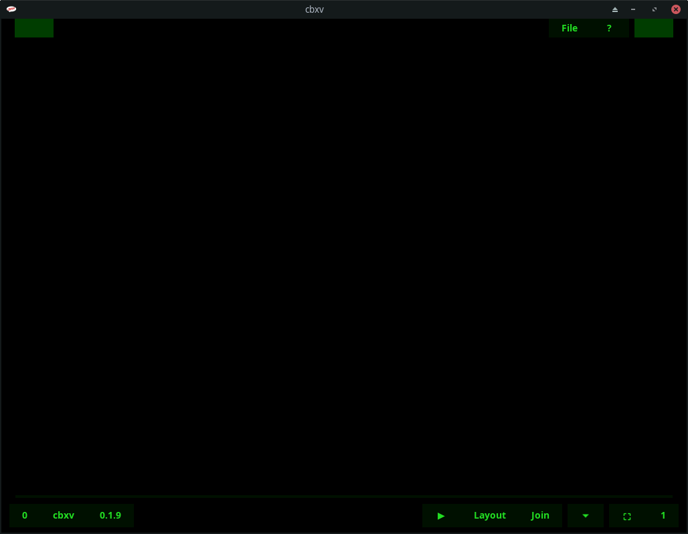

# cbxv user manual

## tl;dr - Quickstart
Open the cbxv archive (.tar.gz, .zip, .dmg), usually by dobule-clicking on it

Locate the executable (cbxv, cbxv.exe, cbxv.app), double-click on it

cbxv will start and you'll see:

Hit the "o" key or click the "File Button" in the upper-right

The File Open Dialog will display, navigate to a cbx (.cbr, .cbz) file, double-click it

You'll see something like:

Note: All comic images shown on these pages are believed to be in the public
domain. If you feel that's in error, please notify me and I will replace them
with ones that are.

In this case we're seeing the cover on the left and the inside cover on the right. 
Hit the "r" key (Join Toggle || Button) and you'll see:

The first page, the cover, has essentially been "Joined" or turned into a single-page
with a span of 2, so that it displays by itself. All of the other pages have also been
adjusted in the layout. Hit the "Right Arrow" key and you'll see:

The inside front cover is now on the left and the first page on the right, just 
as it should be. If the book you're reading has other pages that are out of 
place you can join them or hide them as necessary until the layout is correct. 
cbxv will remember the layout so the next time you open the book it will be 
correct.

Excelsior!

## Dependencies
- Linux - You must have Gtk3 installed. This is very common on Linux. If you 
    don't have it already you must install the appropriate package for your 
    distro.

    - Arch and Fedora   - gtk3
    - Debian and Ubuntu - libgtk-3-0

- Mac - Like Linux you must have Gtk3 installed. This is less common than Linux
    but faily straightforward. Install <a href="https://brew.sh">Homebrew</a> and run:

    brew install pkg-config gtk+3 adwaita-icon-theme

- Windows - Everything that you need is in the archive available under the 
    releases section.

## Installation
-   Linux - Download the Linux build from the release area and unarchive it. 
    On Linux cbxv is a single executable, put it wherever you like and run it. 
    For your convenience a simple script is provided to put a desktop file and 
    icon in the appropriate places for your user.

-   Windows - Download the Windows build from the release area and unarchive it. 
    Copy the resulting directory to program files or wherever you like and run it.

-   Mac - Download the Mac build from the release area and unarchive it. Copy the 
    cbxv.app directory to Applications and double-click on it.

## Interface Elements

## Commands

### File Commands
- openFile            
    The openFile command when given no arguments will prompt you with the 
    fileOpen dialog to provide a file path. After a path is provided any file
    open in the UI will be closed and the new file will be opened and loaded
    into the interface. 

    The fileOpen dialog by default is configured to restrict choosing only files 
    that end with an appropriate extension, but you can change it to all files. 
    Whatever file you specify either with the fileDialog or from the command 
    line cbxv will try to open it. If it's a valid file with an inappropriate 
    extension like .zip it may very well succeed. If it's simply an invalid file 
    it will fail.

    Keys: o  
    Mouse: The File Button  
    CLI: If you start cbxv from the command line you can provide a path and it 
        will be opened.  

- closeFile           
    The closeFile command will close any open file and unload it

    Keys: c

### Navigation Commands
- Overview  
    cbxv is a viewer, most of what you do is navigating around so you can read
    the comic you have loaded. Consequently there are quite a few keys dedicated
    to basic navigation. 3 "sets" in fact; "Standard Keys" - Arrow Cluster, 
    "Gamer Keys" - "wasd", and "Vi Keys" - "hjkl".

- rightPage           
    Always takes you one page to the right. If you have the reading Direction
    set to Left-To-Right, then it will take you to the next page. If you toggle
    the reading Direction to Right-To-Left, then going a page to the right will
    take you to the previous page.  

    This key can also trigger next file or previous file when at the end or
    beggining of the comic.

    Keys: [RightArrow] or d or l  
    Mouse: Click on the right side of the screen

- leftPage  
    Always takes you one page to the left. If you have the reading Direction
    set to Left-To-Right, then it will take you to the previous page. If you 
    toggle the reading Direction to Right-To-Left, then going a page to the 
    left will take you to the next page.

    This key can also trigger next file or previous file when at the end or
    beggining of the comic.

    Keys: [LeftArrow] or w or h  
    Mouse: Click on the left side of the screen

- firstPage  
    Always takes you to the first page

    Keys: [UpArrow] or w or k

- lastPage  
    Always takes you to the last page

    Keys: [DownArrow] or j or s

- nextFile  
    Whenever you open a cbx file cbxv creates a sorted list of all the cbx files
    in the same directory and the position of the current file in that list. The
    nextFile command takes you to the next cbx file in the list.

    Keys: n

- previousFile  
    Whenever you open a cbx file cbxv creates a sorted list of all the cbx files
    in the same directory and the position of the current file in that list. The
    previousFile command takes you to the previous cbx file in the list.

    Keys: p

### Page Commands
- selectPage  
    The selectPage command allows you to change the selectedPage. In a 2-page 
    layout one of the two pages will have a highlighted border around it's 
    pageIndex button indicating that it's selected.

    Keys: [Tab]  
    Mouse: pageIndex Buttons  

- exportPage  
    The exportPage command will bring up the export dialog allowing you to save
    the currently selected page as an mage file wherever you want independent of 
    the cbx file you are viewing.

    Keys: e

### Bookmark Commands
- toggleBookmark  
    The toggleBookmark command sets or unsets the bookmark on the currently
    selected page
    
    Keys: [Space]  
    Mouse: Boomkark Buttons  

- lastBookmark  
    Use the lastBookmark command to move to the boomkark on the highest page

    Keys: L

### Layout Commands
- toggleDirection  
    The direction command sets either Left-To-Right or Right-To-Left reading
    direction.

    Keys: [BackTick]  
    Mouse: Direction Button  

- 1-Page Layout  
    The 1-Page Layout command sets the layout to one page at a time.

    Keys: 1

- 2-Page Layout  
    The 2-Page Layout command sets the layout to view up to two pages at a time.

    Keys: 2

- stripLayout  
    Strip Layout arranges all pages in one long vertical strip. The strip layout
    is much simpler and removes many commands and controls that are not 
    applicable.

    Keys: 3

- hidePage  
    The hidePage command hides the currently selected page from view. You can
    see the list of hidden pages for the current cbx file with the HiddenPages 
    control.

    Keys: -

- toggleJoin  
    The toggleJoin command causes 1-page to be treated as two for the purposes
    of layout. The term "join" is borrowed from the scanning community where
    generally 2 images from adjacent pages are joined together to emulate a 
    a double-page spread. In cbxv such pages are auto-joined. Other pages that
    you might want to join are covers. They will be treated as having a span of
    2, causing them to occupy both spots of a spread in a two-page layout
    forcing any other page to the next spread. That means the cover will be
    displayed by itself while staying in 2-page layout mode. the command has
    no effect in either 1-page or strip modes.

    Keys: r

### General Commands
- quit  
    The quit command saves any accumulated state (layout changes, bookmarks,
    etc...) and exits the program.

    Keys: q

- help  
    The help command brings up the help dialog, displaying summary information
    for all commands and providing a link to the manual.

    Keys: ? or [F1]

- toggleFullscreen  
    toggleFullscreen command toggle fullscreen mode on and off

    Keys: f or [F11]

### Supported File Formats
- .cbz - zip archive
- .cbr - rar archive
- .cb7 - 7zip archive
- .cbt - tar archive
- .pdf - portable document format file

