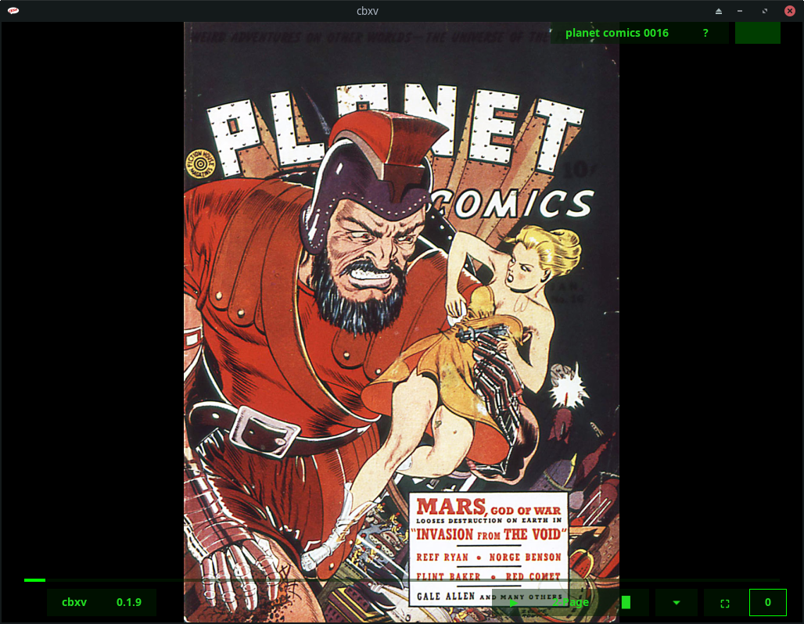

# cbxv user manual

## tl;dr - Quickstart
Open the archive (.tar.gz, .zip, .dmg), usually by dobule-clicking on it

Locate the executable (cbxv, cbxv.exe, cbxv.app), double-click on it

cbxv will start and you'll see:

Hit the "o" key or click the "File Button" in the upper-right

The File Open Dialog will display, navigate to a cbx (.cbr, .cbz) file, double-click it

You'll see something like:

In this case we're seeing the cover on the left and the inside cover on the right. 
Hit the "r" key (Join Toggle || Button) and you'll see:

The first page, the cover, has essentially been "Joined" or turned into a single-page
with a span of 2, so that it displays by itself. All of the other pages have also been
adjusted in the layout. Hit the "Right Arrow" key and you'll see:

The inside front cover is now on the left and the first page on the right, just 
as it should be. If the book you're reading has other pages that are out of 
place you can join them or hide them as necessary until the layout is correct. 
cbxv will remember the layout so the next time you open the book it will be 
correct.

Excelsior!

## Dependencies
- Linux - You must have Gtk3 installed. This is very common on Linux. If you 
    don't have it already you must install the appropriate package for your 
    distro.

    - Arch and Fedora   - gtk3
    - Debian and Ubuntu - libgtk-3-0

- Windows and Mac - Everything that you need is in the archive available under 
    the releases section.

## Installation
-   Linux - Download the Linux build from the release area and unarchive it. 
    On Linux cbxv is a single executable, put it wherever you like and run it. 
    For your convenience a simple script is provided to put a desktop file and 
    icon in the appropriate places for your user.

-   Windows - Download the Windows build from the release area and unarchive it. 
    Copy the resulting directory to program files or wherever you like and run it.

-   Mac - Download the Mac build from the release area and unarchive it. Copy the 
    cbxv.app directory to Applications and double-click on it.

## Interface Elements

## Commands

### File Commands
openFile            o                   File Button
closeFile           c                   NA

### Navigation Commands
rightPage           d|l|[RightArrow]    right side
leftPage            a|h|[LeftArrow]     left side
firstPage           w|k|[UpArrow]       NA
lastPage            s|j|[DownArrow]     NA
nextFile            n                   NA
previousFile        p                   NA

### Page Commands
selectPage          [Tab]               NA
exportPage          e                   NA

### Bookmark Commands
addBookmark         [Space]             NA
lastBookmark        L                   NA

### Layout Commands
Direction           [BackTick]          Direction Button
1-Page Layout       1                   NA
2-Page Layout       2                   NA
stripLayout         3                   NA
hidePage            -                   NA
toggleJoin          r                   Join Toggle

### General Commands
quit                q                   Window Close Button 
help                ?|[F1]              Question Mark Button
toggleFullscreen    f                   Fullscreen Toggle

